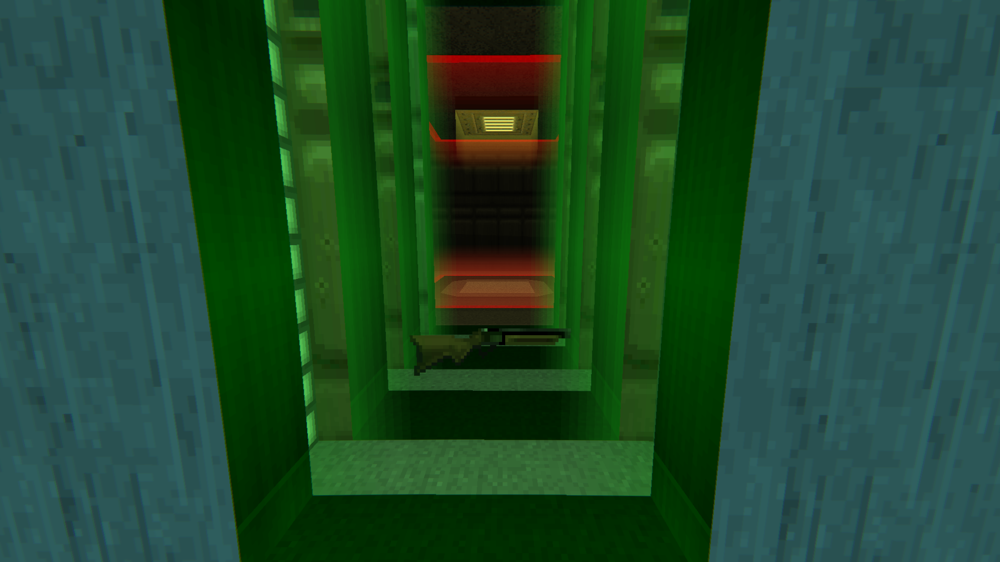
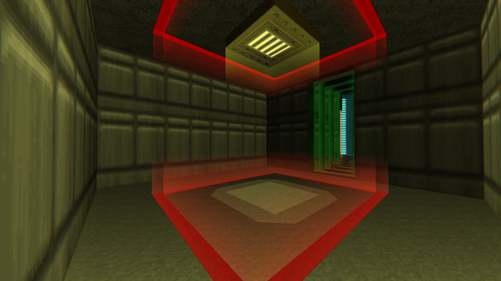
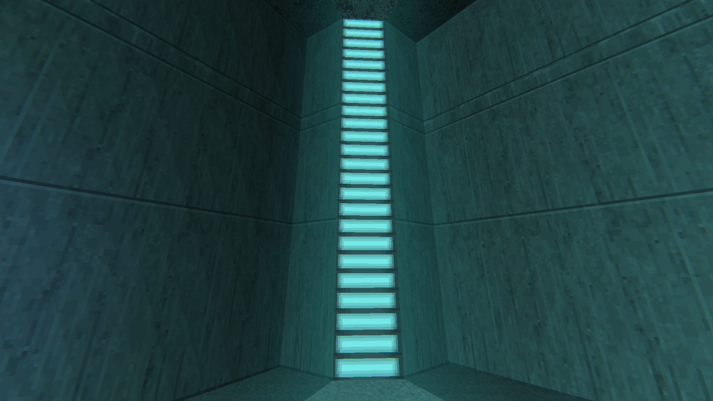
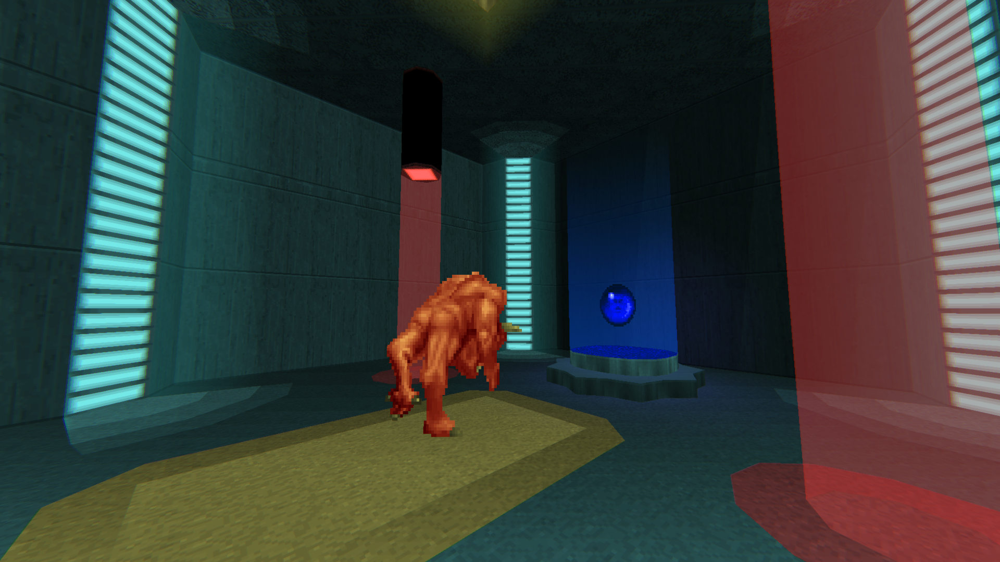
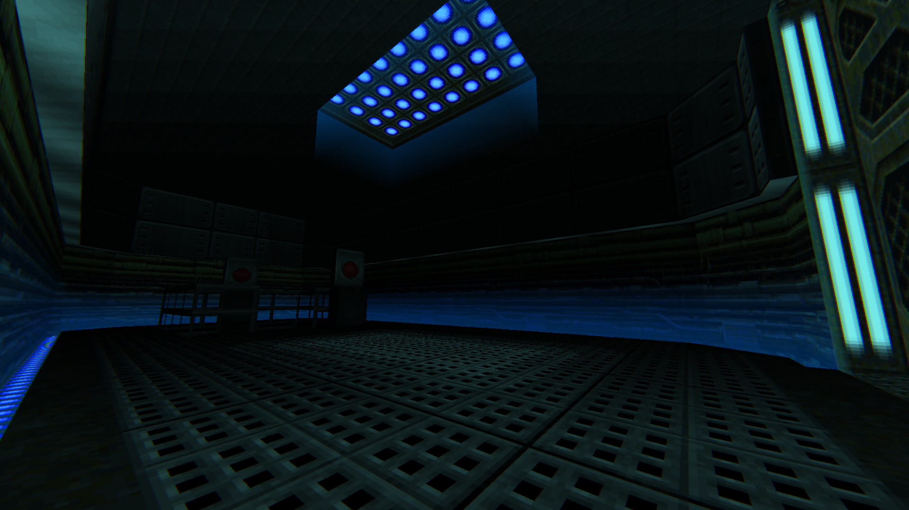
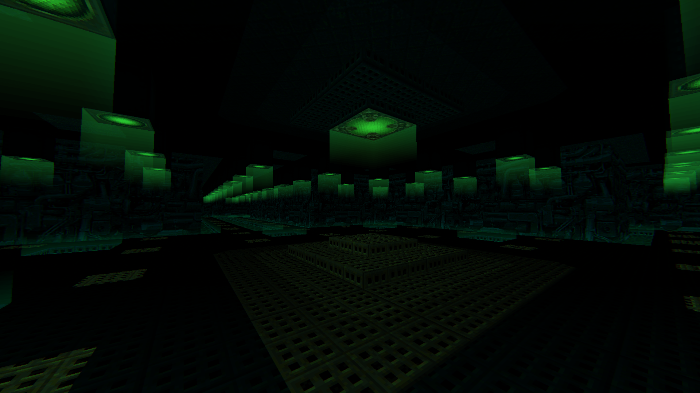
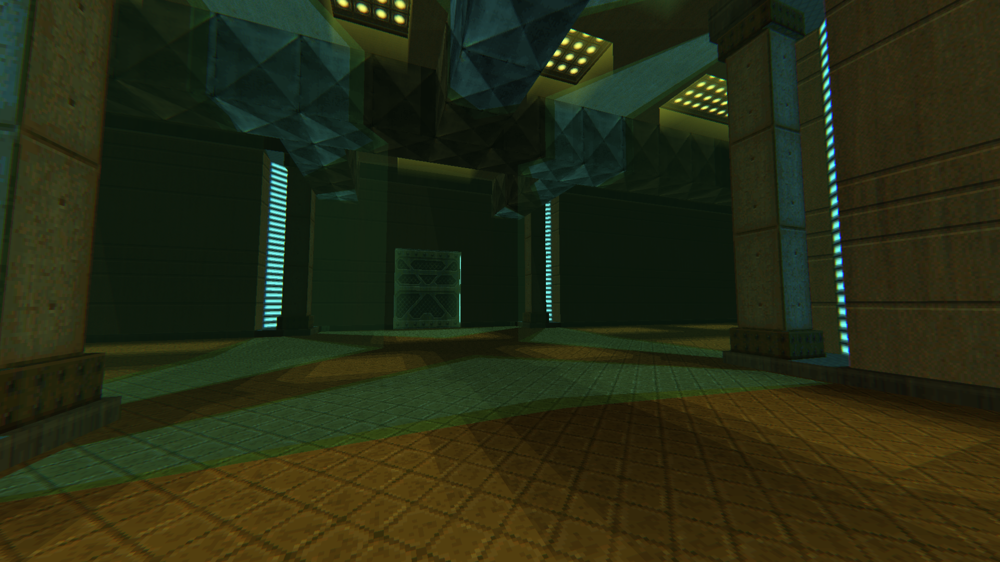
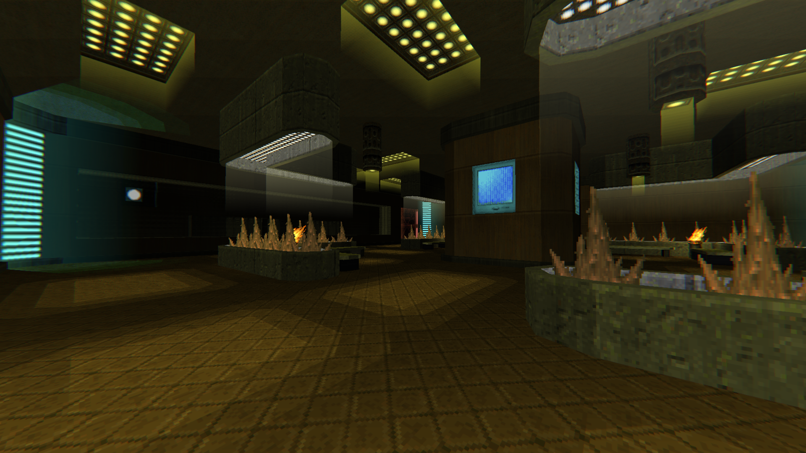

# Lighting Textures by DRON12261 [Resource for Mapping]

# STATUS: ✅RELEASED

## Download:
- [Texture Pack](https://github.com/Doom-Mapping-Modding-Lair-DRON12261/RES-Lighting-Textures/releases/latest/download/LightTextures.wad)
- [Example Map (UDMF)](https://github.com/Doom-Mapping-Modding-Lair-DRON12261/RES-Lighting-Textures/releases/latest/download/LightTextures_ExampleMap.wad)

# Example screenshots:

## From Example map:

## From [The Dark Side of Phobos REMAKE](https://github.com/Doom-Mapping-Modding-Lair-DRON12261/WAD-TDSOP-Remake)

